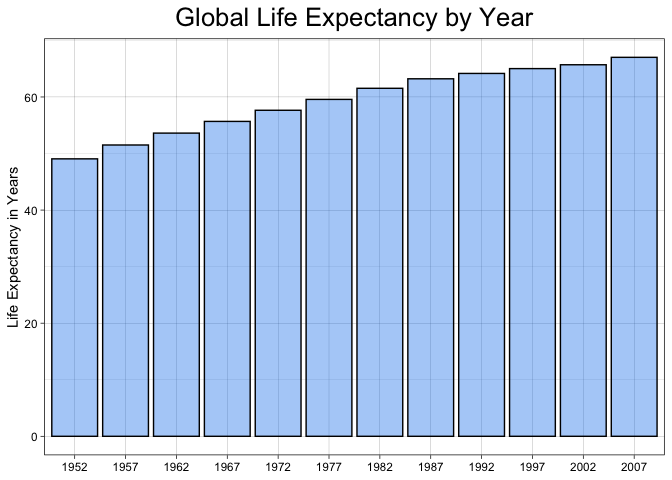
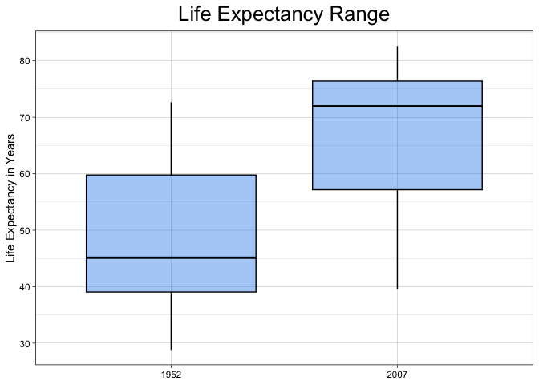
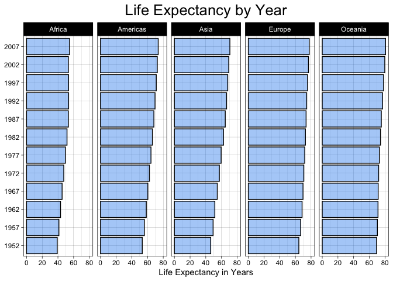
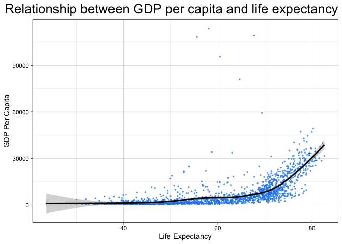
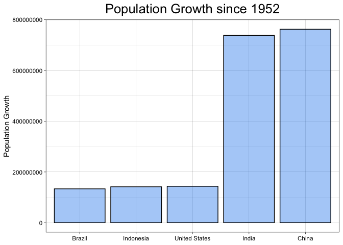
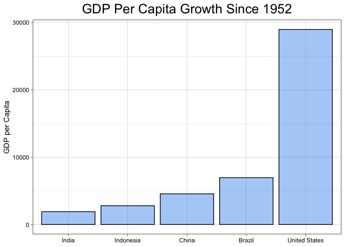
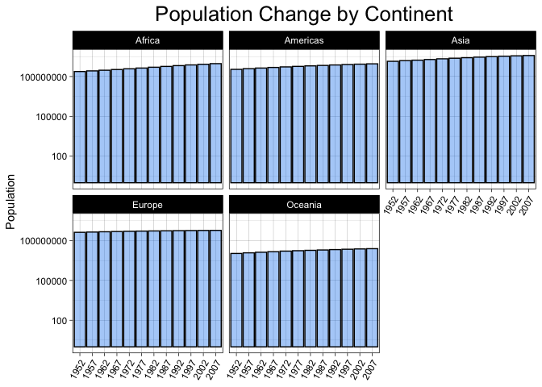

## Instructions
Answer the following questions and complete the exercises in RMarkdown. Please embed all of your code and push your final work to your repository. Your final lab report should be organized, clean, and run free from errors. Remember, you must remove the `#` for the included code chunks to run. Be sure to add your name to the author header above. For any included plots, make sure they are clearly labeled. You are free to use any plot type that you feel best communicates the results of your analysis.  

**In this homework, you should make use of the aesthetics you have learned. It's OK to be flashy!**

Make sure to use the formatting conventions of RMarkdown to make your report neat and clean!  

## Load the libraries

```r
library(tidyverse)
library(janitor)
library(here)
library(naniar)
```


```r
options(scipen = 999)
```

## Resources
The idea for this assignment came from [Rebecca Barter's](http://www.rebeccabarter.com/blog/2017-11-17-ggplot2_tutorial/) ggplot tutorial so if you get stuck this is a good place to have a look.  

## Gapminder
For this assignment, we are going to use the dataset [gapminder](https://cran.r-project.org/web/packages/gapminder/index.html). Gapminder includes information about economics, population, and life expectancy from countries all over the world. You will need to install it before use. This is the same data that we will use for midterm 2 so this is good practice.

```r
#install.packages("gapminder")
library("gapminder")
```

## Questions
The questions below are open-ended and have many possible solutions. Your approach should, where appropriate, include numerical summaries and visuals. Be creative; assume you are building an analysis that you would ultimately present to an audience of stakeholders. Feel free to try out different `geoms` if they more clearly present your results.  

**1. Use the function(s) of your choice to get an idea of the overall structure of the data frame, including its dimensions, column names, variable classes, etc. As part of this, determine how NAs are treated in the data.**  


```r
summary(gapminder)
```

```
##         country        continent        year         lifeExp     
##  Afghanistan:  12   Africa  :624   Min.   :1952   Min.   :23.60  
##  Albania    :  12   Americas:300   1st Qu.:1966   1st Qu.:48.20  
##  Algeria    :  12   Asia    :396   Median :1980   Median :60.71  
##  Angola     :  12   Europe  :360   Mean   :1980   Mean   :59.47  
##  Argentina  :  12   Oceania : 24   3rd Qu.:1993   3rd Qu.:70.85  
##  Australia  :  12                  Max.   :2007   Max.   :82.60  
##  (Other)    :1632                                                
##       pop               gdpPercap       
##  Min.   :     60011   Min.   :   241.2  
##  1st Qu.:   2793664   1st Qu.:  1202.1  
##  Median :   7023596   Median :  3531.8  
##  Mean   :  29601212   Mean   :  7215.3  
##  3rd Qu.:  19585222   3rd Qu.:  9325.5  
##  Max.   :1318683096   Max.   :113523.1  
## 
```

```r
glimpse(gapminder)
```

```
## Rows: 1,704
## Columns: 6
## $ country   <fct> "Afghanistan", "Afghanistan", "Afghanistan", "Afghanistan", …
## $ continent <fct> Asia, Asia, Asia, Asia, Asia, Asia, Asia, Asia, Asia, Asia, …
## $ year      <int> 1952, 1957, 1962, 1967, 1972, 1977, 1982, 1987, 1992, 1997, …
## $ lifeExp   <dbl> 28.801, 30.332, 31.997, 34.020, 36.088, 38.438, 39.854, 40.8…
## $ pop       <int> 8425333, 9240934, 10267083, 11537966, 13079460, 14880372, 12…
## $ gdpPercap <dbl> 779.4453, 820.8530, 853.1007, 836.1971, 739.9811, 786.1134, …
```

```r
miss_var_summary(gapminder)
```

```
## # A tibble: 6 × 3
##   variable  n_miss pct_miss
##   <chr>      <int>    <dbl>
## 1 country        0        0
## 2 continent      0        0
## 3 year           0        0
## 4 lifeExp        0        0
## 5 pop            0        0
## 6 gdpPercap      0        0
```
There are no NAs in the data.

**2. Among the interesting variables in gapminder is life expectancy. How has global life expectancy changed between 1952 and 2007?**


```r
gapminder %>% 
  mutate(year=as.factor(year)) %>% 
  group_by(year) %>% 
  summarize(global_life_exp=mean(lifeExp))
```

```
## # A tibble: 12 × 2
##    year  global_life_exp
##    <fct>           <dbl>
##  1 1952             49.1
##  2 1957             51.5
##  3 1962             53.6
##  4 1967             55.7
##  5 1972             57.6
##  6 1977             59.6
##  7 1982             61.5
##  8 1987             63.2
##  9 1992             64.2
## 10 1997             65.0
## 11 2002             65.7
## 12 2007             67.0
```

```r
#grDevices::colors()
```


```r
gapminder %>% 
  mutate(year=as.factor(year)) %>% 
  group_by(year) %>% 
  summarize(global_life_exp=mean(lifeExp)) %>% 
  ggplot(aes(x=year, y=global_life_exp))+
  theme_linedraw()+
  geom_col(color="black", fill="dodgerblue2", alpha=0.4)+
  theme(plot.title=element_text(size = rel(1.75), hjus=0.5))+
  labs(title="Global Life Expectancy by Year", 
       x=NULL, y="Life Expectancy in Years")
```

<!-- -->

**3. How do the distributions of life expectancy compare for the years 1952 and 2007?**


```r
gapminder %>% 
  filter(year==1952) %>% 
  count(lifeExp)
```

```
## # A tibble: 142 × 2
##    lifeExp     n
##      <dbl> <int>
##  1    28.8     1
##  2    30       1
##  3    30.0     1
##  4    30.3     1
##  5    31.3     1
##  6    32.0     1
##  7    32.5     1
##  8    32.5     1
##  9    33.0     1
## 10    33.6     1
## # ℹ 132 more rows
```

```r
gapminder %>% 
  filter(year==2007) %>% 
  count(lifeExp)
```

```
## # A tibble: 142 × 2
##    lifeExp     n
##      <dbl> <int>
##  1    39.6     1
##  2    42.1     1
##  3    42.4     1
##  4    42.6     1
##  5    42.6     1
##  6    42.7     1
##  7    43.5     1
##  8    43.8     1
##  9    44.7     1
## 10    45.7     1
## # ℹ 132 more rows
```

```r
gapminder %>% 
  mutate(year=as.factor(year)) %>% 
  filter(year==1952 | year==2007) %>% 
  ggplot(aes(x=year, y=lifeExp))+
  theme_linedraw()+
  geom_boxplot(color="black", fill="dodgerblue2", alpha=0.4)+
  theme(plot.title=element_text(size = rel(1.75), hjus=0.5))+
  labs(title="Life Expectancy Range", 
       x=NULL, y="Life Expectancy in Years")
```

<!-- -->

**4. Your answer above doesn't tell the whole story since life expectancy varies by region. Make a summary that shows the min, mean, and max life expectancy by continent for all years represented in the data.**


```r
gapminder %>% 
  group_by(continent, year) %>% 
  summarize(min_life_exp=min(lifeExp), 
            mean_life_exp=mean(lifeExp), 
            max_life_exp=max(lifeExp), .groups='keep')
```

```
## # A tibble: 60 × 5
## # Groups:   continent, year [60]
##    continent  year min_life_exp mean_life_exp max_life_exp
##    <fct>     <int>        <dbl>         <dbl>        <dbl>
##  1 Africa     1952         30            39.1         52.7
##  2 Africa     1957         31.6          41.3         58.1
##  3 Africa     1962         32.8          43.3         60.2
##  4 Africa     1967         34.1          45.3         61.6
##  5 Africa     1972         35.4          47.5         64.3
##  6 Africa     1977         36.8          49.6         67.1
##  7 Africa     1982         38.4          51.6         69.9
##  8 Africa     1987         39.9          53.3         71.9
##  9 Africa     1992         23.6          53.6         73.6
## 10 Africa     1997         36.1          53.6         74.8
## # ℹ 50 more rows
```

**5. How has life expectancy changed between 1952-2007 for each continent?**


```r
gapminder %>% 
  mutate(year=as.factor(year)) %>% 
  group_by(continent, year) %>% 
  summarize(mean_life_exp=mean(lifeExp), .groups='keep') %>% 
  ggplot(aes(x=year, y=mean_life_exp))+
  facet_grid(~continent)+
  theme_linedraw()+
  geom_col(color="black", fill="dodgerblue2", alpha=0.4)+
  theme(plot.title=element_text(size = rel(1.75), hjus=0.5))+
  labs(title="Life Expectancy by Year", 
       x=NULL, y="Life Expectancy in Years")+
  coord_flip()
```

<!-- -->


**6. We are interested in the relationship between per capita GDP and life expectancy; i.e. does having more money help you live longer?**


```r
gapminder %>% 
  ggplot(aes(x=lifeExp, y=gdpPercap))+
  geom_point(size=0.5, color="dodgerblue2", alpha=0.6)+
  geom_smooth(color="black")+
  theme_linedraw()+
  theme(plot.title=element_text(size = rel(1.75), hjus=1))+
  labs(title="Relationship between GDP per capita and life expectancy", 
         x="Life Expectancy", 
         y="GDP Per Capita")
```

```
## `geom_smooth()` using method = 'gam' and formula = 'y ~ s(x, bs = "cs")'
```

<!-- -->


**7. Which countries have had the largest population growth since 1952?**


```r
gapminder %>% 
  filter(year==1952 | year==2007) %>% 
  select(country, year, pop) %>% 
  group_by(country) %>% 
  pivot_wider(names_from = year, values_from = pop, names_prefix = "yr_") %>% 
  mutate(population_growth=yr_2007-yr_1952) %>% 
  arrange(desc(population_growth))
```

```
## # A tibble: 142 × 4
## # Groups:   country [142]
##    country         yr_1952    yr_2007 population_growth
##    <fct>             <int>      <int>             <int>
##  1 China         556263527 1318683096         762419569
##  2 India         372000000 1110396331         738396331
##  3 United States 157553000  301139947         143586947
##  4 Indonesia      82052000  223547000         141495000
##  5 Brazil         56602560  190010647         133408087
##  6 Pakistan       41346560  169270617         127924057
##  7 Bangladesh     46886859  150448339         103561480
##  8 Nigeria        33119096  135031164         101912068
##  9 Mexico         30144317  108700891          78556574
## 10 Philippines    22438691   91077287          68638596
## # ℹ 132 more rows
```


**8. Use your results from the question above to plot population growth for the top five countries since 1952.**


```r
gapminder %>% 
  filter(year==1952 | year==2007) %>% 
  select(country, year, pop) %>% 
  group_by(country) %>% 
  pivot_wider(names_from = year, values_from = pop, names_prefix = "yr_") %>% 
  mutate(population_growth=yr_2007-yr_1952) %>% 
  arrange(desc(population_growth)) %>% 
  head(5) %>% 
  ggplot(aes(x=reorder(country, population_growth), y=population_growth))+
  geom_col(color="black", fill="dodgerblue2", alpha=0.4)+
  theme_linedraw()+
  theme(plot.title=element_text(size = rel(1.75), hjus=0.5))+
  labs(title="Population Growth since 1952", 
       x=NULL, y="Population Growth")
```

<!-- -->

**9. How does per capita GDP growth compare between these same five countries?**


```r
gapminder %>% 
  filter(year==1952 | year==2007) %>% 
  filter(country=="Brazil" | country=="Indonesia" | country=="United States" | country=="India" | country=="China") %>% 
  select(country, year, gdpPercap) %>% 
  group_by(country) %>% 
  pivot_wider(names_from = year, values_from = gdpPercap, names_prefix = "yr_") %>% 
  mutate(gdp_growth=yr_2007-yr_1952) %>% 
  arrange(desc(gdp_growth))
```

```
## # A tibble: 5 × 4
## # Groups:   country [5]
##   country       yr_1952 yr_2007 gdp_growth
##   <fct>           <dbl>   <dbl>      <dbl>
## 1 United States  13990.  42952.     28961.
## 2 Brazil          2109.   9066.      6957.
## 3 China            400.   4959.      4559.
## 4 Indonesia        750.   3541.      2791.
## 5 India            547.   2452.      1906.
```

```r
gapminder %>% 
  filter(year==1952 | year==2007) %>% 
  filter(country=="Brazil" | country=="Indonesia" | country=="United States" | country=="India" | country=="China") %>% 
  select(country, year, gdpPercap) %>% 
  group_by(country) %>% 
  pivot_wider(names_from = year, values_from = gdpPercap, names_prefix = "yr_") %>% 
  mutate(gdp_growth=yr_2007-yr_1952) %>% 
  arrange(desc(gdp_growth)) %>% 
  ggplot(aes(x=reorder(country, gdp_growth), y=gdp_growth))+
  geom_col(color="black", fill="dodgerblue2", alpha=0.4)+
  theme_linedraw()+
  theme(plot.title=element_text(size = rel(1.75), hjus=0.5))+
  labs(title="GDP Per Capita Growth Since 1952", 
       x=NULL, y="GDP per Capita")
```

<!-- -->
**10. Make one plot of your choice that uses faceting!**


```r
gapminder %>% 
  mutate(year=as.factor(year)) %>% 
  group_by(continent, year) %>% 
  summarize(population=sum(pop), .groups='keep') %>% 
  ggplot(aes(x=year, y=population))+
  facet_wrap(~continent)+
  geom_col(color="black", fill="dodgerblue2", alpha=0.4)+
  scale_y_log10()+
  theme_linedraw()+
  theme(plot.title=element_text(size = rel(1.75), hjus=0.5), 
        axis.text.x = element_text(angle = 60, hjust=1))+
  labs(title="Population Change by Continent", 
       x=NULL, y="Population")
```

<!-- -->
Note: the graphs look rather similar to each other because I'm scaling the y-axis by log 10. Without it, it's difficult to read the values for Oceania.

## Push your final code to GitHub!
Please be sure that you check the `keep md` file in the knit preferences. 
