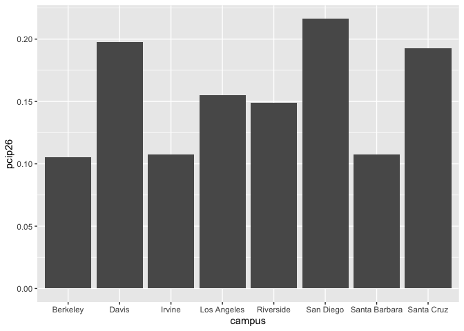

## Instructions
Answer the following questions and complete the exercises in RMarkdown. Please embed all of your code and push your final work to your repository. Your final lab report should be organized, clean, and run free from errors. Remember, you must remove the `#` for the included code chunks to run. Be sure to add your name to the author header above.  

Make sure to use the formatting conventions of RMarkdown to make your report neat and clean!  

## Load the libraries

```r
library(tidyverse)
library(janitor)
library(here)
library(naniar)
```

For this homework, we will take a departure from biological data and use data about California colleges. These data are a subset of the national college scorecard (https://collegescorecard.ed.gov/data/). Load the `ca_college_data.csv` as a new object called `colleges`.

```r
colleges <- read_csv("data/ca_college_data.csv")
```

```
## Rows: 341 Columns: 10
## ── Column specification ────────────────────────────────────────────────────────
## Delimiter: ","
## chr (4): INSTNM, CITY, STABBR, ZIP
## dbl (6): ADM_RATE, SAT_AVG, PCIP26, COSTT4_A, C150_4_POOLED, PFTFTUG1_EF
## 
## ℹ Use `spec()` to retrieve the full column specification for this data.
## ℹ Specify the column types or set `show_col_types = FALSE` to quiet this message.
```

```r
names(colleges)
```

```
##  [1] "INSTNM"        "CITY"          "STABBR"        "ZIP"          
##  [5] "ADM_RATE"      "SAT_AVG"       "PCIP26"        "COSTT4_A"     
##  [9] "C150_4_POOLED" "PFTFTUG1_EF"
```

The variables are a bit hard to decipher, here is a key:  

INSTNM: Institution name  
CITY: California city  
STABBR: Location state  
ZIP: Zip code  
ADM_RATE: Admission rate  
SAT_AVG: SAT average score  
PCIP26: Percentage of degrees awarded in Biological And Biomedical Sciences  
COSTT4_A: Annual cost of attendance  
C150_4_POOLED: 4-year completion rate  
PFTFTUG1_EF: Percentage of undergraduate students who are first-time, full-time degree/certificate-seeking undergraduate students  

1. Use your preferred function(s) to have a look at the data and get an idea of its structure. Make sure you summarize NA's and determine whether or not the data are tidy. You may also consider dealing with any naming issues.


```r
summary(colleges)
```

```
##     INSTNM              CITY              STABBR              ZIP           
##  Length:341         Length:341         Length:341         Length:341        
##  Class :character   Class :character   Class :character   Class :character  
##  Mode  :character   Mode  :character   Mode  :character   Mode  :character  
##                                                                             
##                                                                             
##                                                                             
##                                                                             
##     ADM_RATE         SAT_AVG         PCIP26           COSTT4_A    
##  Min.   :0.0807   Min.   : 870   Min.   :0.00000   Min.   : 7956  
##  1st Qu.:0.4581   1st Qu.: 985   1st Qu.:0.00000   1st Qu.:12578  
##  Median :0.6370   Median :1078   Median :0.00000   Median :16591  
##  Mean   :0.5901   Mean   :1112   Mean   :0.01981   Mean   :26685  
##  3rd Qu.:0.7461   3rd Qu.:1237   3rd Qu.:0.02457   3rd Qu.:39289  
##  Max.   :1.0000   Max.   :1555   Max.   :0.21650   Max.   :69355  
##  NA's   :240      NA's   :276    NA's   :35        NA's   :124    
##  C150_4_POOLED     PFTFTUG1_EF    
##  Min.   :0.0625   Min.   :0.0064  
##  1st Qu.:0.4265   1st Qu.:0.3212  
##  Median :0.5845   Median :0.5016  
##  Mean   :0.5705   Mean   :0.5577  
##  3rd Qu.:0.7162   3rd Qu.:0.8117  
##  Max.   :0.9569   Max.   :1.0000  
##  NA's   :221      NA's   :53
```

```r
head(colleges)
```

```
## # A tibble: 6 × 10
##   INSTNM       CITY  STABBR ZIP   ADM_RATE SAT_AVG PCIP26 COSTT4_A C150_4_POOLED
##   <chr>        <chr> <chr>  <chr>    <dbl>   <dbl>  <dbl>    <dbl>         <dbl>
## 1 Grossmont C… El C… CA     9202…       NA      NA 0.0016     7956            NA
## 2 College of … Visa… CA     9327…       NA      NA 0.0066     8109            NA
## 3 College of … San … CA     9440…       NA      NA 0.0038     8278            NA
## 4 Ventura Col… Vent… CA     9300…       NA      NA 0.0035     8407            NA
## 5 Oxnard Coll… Oxna… CA     9303…       NA      NA 0.0085     8516            NA
## 6 Moorpark Co… Moor… CA     9302…       NA      NA 0.0151     8577            NA
## # ℹ 1 more variable: PFTFTUG1_EF <dbl>
```


```r
colleges <- clean_names(colleges)
colleges
```

```
## # A tibble: 341 × 10
##    instnm      city  stabbr zip   adm_rate sat_avg pcip26 costt4_a c150_4_pooled
##    <chr>       <chr> <chr>  <chr>    <dbl>   <dbl>  <dbl>    <dbl>         <dbl>
##  1 Grossmont … El C… CA     9202…       NA      NA 0.0016     7956        NA    
##  2 College of… Visa… CA     9327…       NA      NA 0.0066     8109        NA    
##  3 College of… San … CA     9440…       NA      NA 0.0038     8278        NA    
##  4 Ventura Co… Vent… CA     9300…       NA      NA 0.0035     8407        NA    
##  5 Oxnard Col… Oxna… CA     9303…       NA      NA 0.0085     8516        NA    
##  6 Moorpark C… Moor… CA     9302…       NA      NA 0.0151     8577        NA    
##  7 Skyline Co… San … CA     9406…       NA      NA 0          8580         0.233
##  8 Glendale C… Glen… CA     9120…       NA      NA 0.002      9181        NA    
##  9 Citrus Col… Glen… CA     9174…       NA      NA 0.0021     9281        NA    
## 10 Fresno Cit… Fres… CA     93741       NA      NA 0.0324     9370        NA    
## # ℹ 331 more rows
## # ℹ 1 more variable: pftftug1_ef <dbl>
```


2. Which cities in California have the highest number of colleges?


```r
colleges %>% 
  group_by(city) %>% 
  summarize(n_colleges=n()) %>% 
  arrange(desc(n_colleges))
```

```
## # A tibble: 161 × 2
##    city          n_colleges
##    <chr>              <int>
##  1 Los Angeles           24
##  2 San Diego             18
##  3 San Francisco         15
##  4 Sacramento            10
##  5 Berkeley               9
##  6 Oakland                9
##  7 Claremont              7
##  8 Pasadena               6
##  9 Fresno                 5
## 10 Irvine                 5
## # ℹ 151 more rows
```

3. Based on your answer to #2, make a plot that shows the number of colleges in the top 10 cities.


```r
colleges %>% 
  group_by(city) %>% 
  summarize(n_colleges=n()) %>% 
  top_n(10, n_colleges) %>% 
  arrange(desc(n_colleges)) %>% 
  ggplot(aes(x=city, y=n_colleges))+
  geom_col()+
  coord_flip()
```

<!-- -->
4. The column `COSTT4_A` is the annual cost of each institution. Which city has the highest average cost? Where is it located?


```r
colleges %>% 
  group_by(city) %>% 
  summarize(mean_tuition=mean(costt4_a, na.rm = T),
            n_colleges=n()) %>% 
  arrange(desc(mean_tuition))
```

```
## # A tibble: 161 × 3
##    city                mean_tuition n_colleges
##    <chr>                      <dbl>      <int>
##  1 Claremont                  66498          7
##  2 Malibu                     66152          1
##  3 Valencia                   64686          1
##  4 Orange                     64501          3
##  5 Redlands                   61542          1
##  6 Moraga                     61095          1
##  7 Atherton                   56035          1
##  8 Thousand Oaks              54373          1
##  9 Rancho Palos Verdes        50758          1
## 10 La Verne                   50603          1
## # ℹ 151 more rows
```
Claremont has the highest average annual cost of tuition. It is located in Southern California, near Los Angeles.

5. Based on your answer to #4, make a plot that compares the cost of the individual colleges in the most expensive city. Bonus! Add UC Davis here to see how it compares :>).


```r
colleges %>% 
  filter(city=="Claremont" | instnm=="University of California-Davis", costt4_a!="NA") %>% 
  ggplot(aes(x=instnm, y=costt4_a))+
  geom_col()+
  coord_flip()
```

<!-- -->
I have chosen to exclude the Claremont School of Theology and Claremont Graduate University from the graph, because their tuitions are listed as NA's in the data.

6. The column `ADM_RATE` is the admissions rate by college and `C150_4_POOLED` is the four-year completion rate. Use a scatterplot to show the relationship between these two variables. What do you think this means?


```r
colleges %>% 
  select(adm_rate, c150_4_pooled) %>% 
  count(adm_rate, c150_4_pooled) %>% 
  ggplot(aes(x=adm_rate, y=c150_4_pooled))+
  geom_point(na.rm = T)+
  geom_smooth(method=lm, se=T, na.rm=T)
```

```
## `geom_smooth()` using formula = 'y ~ x'
```

<!-- -->
This graph indicates that there is an inverse relationship between a college's admissions rate and its four-year completion rate. I think that this means that the more competitive a college is to get into, the more likely it is that students will graduate in four years.

7. Is there a relationship between cost and four-year completion rate? (You don't need to do the stats, just produce a plot). What do you think this means?

8. The column titled `INSTNM` is the institution name. We are only interested in the University of California colleges. Make a new data frame that is restricted to UC institutions. You can remove `Hastings College of Law` and `UC San Francisco` as we are only interested in undergraduate institutions.


```r
univ_calif <- colleges %>% 
  filter(instnm=="University of California-Davis"| instnm=="University of California-San Diego" | instnm=="University of California-Irvine" | instnm=="University of California-Riverside" | instnm=="University of California-Los Angeles" | instnm=="University of California-Santa Cruz" | instnm=="University of California-Berkeley" | instnm=="University of California-Santa Barbara" | instnm=="University of California-Hastings College of Law" | instnm=="University of California-San Francisco")
```

Remove `Hastings College of Law` and `UC San Francisco` and store the final data frame as a new object `univ_calif_final`.


```r
univ_calif_final <- univ_calif %>% 
  filter(instnm!="University of California-San Francisco" & instnm!="University of California-Hastings College of Law")
```

Use `separate()` to separate institution name into two new columns "UNIV" and "CAMPUS".


```r
univ_calif_final <- univ_calif_final %>% 
  separate(instnm, into=c("univ", "campus"), sep="-")
```


9. The column `ADM_RATE` is the admissions rate by campus. Which UC has the lowest and highest admissions rates? Produce a numerical summary and an appropriate plot.


```r
univ_calif_final %>% 
  count(campus, adm_rate) %>% 
  arrange(adm_rate)
```

```
## # A tibble: 8 × 3
##   campus        adm_rate     n
##   <chr>            <dbl> <int>
## 1 Berkeley         0.169     1
## 2 Los Angeles      0.180     1
## 3 San Diego        0.357     1
## 4 Santa Barbara    0.358     1
## 5 Irvine           0.406     1
## 6 Davis            0.423     1
## 7 Santa Cruz       0.578     1
## 8 Riverside        0.663     1
```


```r
univ_calif_final %>% 
  count(adm_rate, campus) %>% 
  arrange(adm_rate) %>% 
  ggplot(aes(x=campus, y=adm_rate))+
  geom_col()
```

<!-- -->


10. If you wanted to get a degree in biological or biomedical sciences, which campus confers the majority of these degrees? Produce a numerical summary and an appropriate plot.


```r
univ_calif_final %>% 
  count(campus, pcip26) %>% 
  arrange(desc(pcip26))
```

```
## # A tibble: 8 × 3
##   campus        pcip26     n
##   <chr>          <dbl> <int>
## 1 San Diego      0.216     1
## 2 Davis          0.198     1
## 3 Santa Cruz     0.193     1
## 4 Los Angeles    0.155     1
## 5 Riverside      0.149     1
## 6 Santa Barbara  0.108     1
## 7 Irvine         0.107     1
## 8 Berkeley       0.105     1
```


```r
univ_calif_final %>% 
  count(campus, pcip26) %>% 
  arrange(desc(pcip26)) %>% 
  ggplot(aes(x=campus, y=pcip26))+
  geom_col()
```

<!-- -->

## Knit Your Output and Post to [GitHub](https://github.com/FRS417-DataScienceBiologists)
