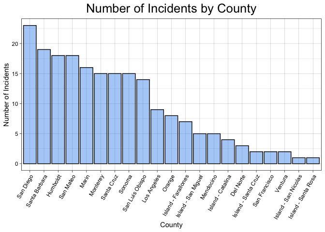
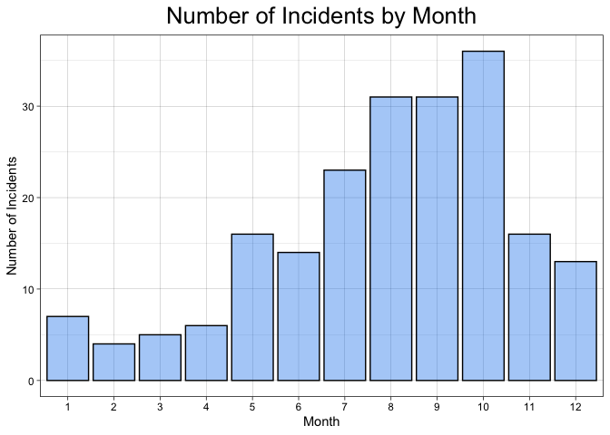
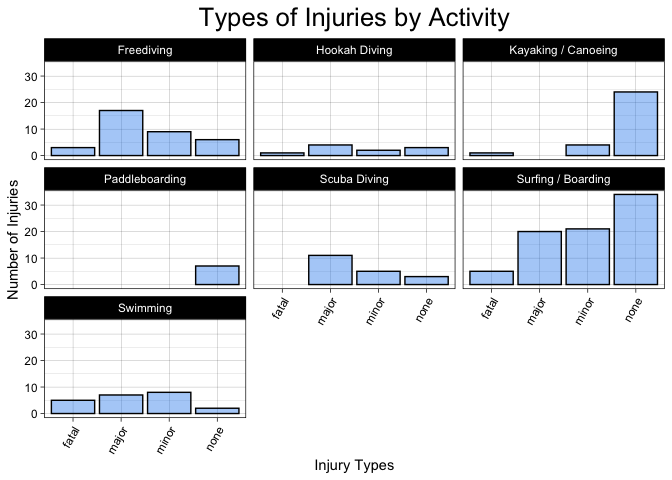
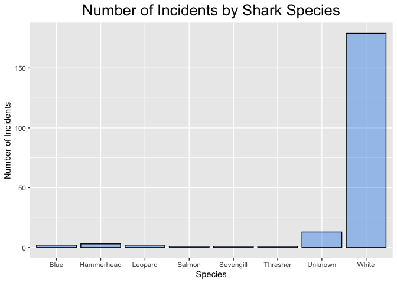
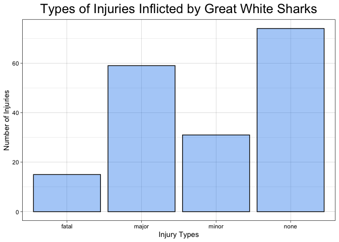
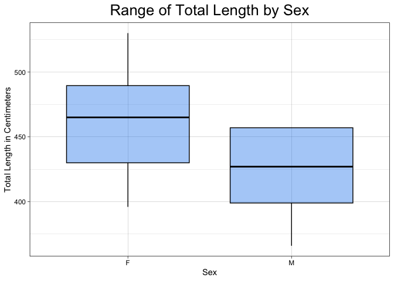
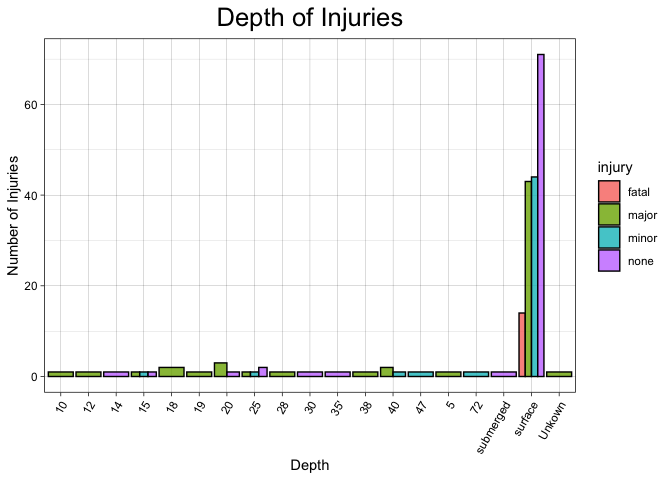

## Instructions
Answer the following questions and complete the exercises in RMarkdown. Please embed all of your code and push your final work to your repository. Your code must be organized, clean, and run free from errors. Remember, you must remove the `#` for any included code chunks to run. Be sure to add your name to the author header above. 

Your code must knit in order to be considered. If you are stuck and cannot answer a question, then comment out your code and knit the document. You may use your notes, labs, and homework to help you complete this exam. Do not use any other resources- including AI assistance.  

Don't forget to answer any questions that are asked in the prompt. Some questions will require a plot, but others do not- make sure to read each question carefully.  

For the questions that require a plot, make sure to have clearly labeled axes and a title. Keep your plots clean and professional-looking, but you are free to add color and other aesthetics.  

Be sure to follow the directions and upload your exam on Gradescope.    

## Background
In the `data` folder, you will find data about shark incidents in California between 1950-2022. The [data](https://catalog.data.gov/dataset/shark-incident-database-california-56167) are from: State of California- Shark Incident Database.   

## Load the libraries

```r
library("tidyverse")
library("janitor")
library("naniar")
```

## Load the data
Run the following code chunk to import the data.

```r
sharks <- read_csv("data/SharkIncidents_1950_2022_220302.csv") %>% clean_names()
```

## Questions
1. (1 point) Start by doing some data exploration using your preferred function(s). What is the structure of the data? Where are the missing values and how are they represented?  


```r
str(sharks)
```

```
## spc_tbl_ [211 × 16] (S3: spec_tbl_df/tbl_df/tbl/data.frame)
##  $ incident_num    : chr [1:211] "1" "2" "3" "4" ...
##  $ month           : num [1:211] 10 5 12 2 8 4 10 5 6 7 ...
##  $ day             : num [1:211] 8 27 7 6 14 28 12 7 14 28 ...
##  $ year            : num [1:211] 1950 1952 1952 1955 1956 ...
##  $ time            : chr [1:211] "12:00" "14:00" "14:00" "12:00" ...
##  $ county          : chr [1:211] "San Diego" "San Diego" "Monterey" "Monterey" ...
##  $ location        : chr [1:211] "Imperial Beach" "Imperial Beach" "Lovers Point" "Pacific Grove" ...
##  $ mode            : chr [1:211] "Swimming" "Swimming" "Swimming" "Freediving" ...
##  $ injury          : chr [1:211] "major" "minor" "fatal" "minor" ...
##  $ depth           : chr [1:211] "surface" "surface" "surface" "surface" ...
##  $ species         : chr [1:211] "White" "White" "White" "White" ...
##  $ comment         : chr [1:211] "Body Surfing, bit multiple times on leg, thigh and body" "Foot & swim fin bitten" "Attacked from below then second time from front, fatal" "Attacked from behind, lost swim fin" ...
##  $ longitude       : chr [1:211] "-117.1466667" "-117.2466667" "-122.05" "-122.15" ...
##  $ latitude        : num [1:211] 32.6 32.6 36.6 36.6 35.1 ...
##  $ confirmed_source: chr [1:211] "Miller/Collier, Coronado Paper, Oceanside Paper" "GSAF - with photos" "Miller/Collier, Coronado Paper" "Miller/Collier, Santa Cruz Sentinel" ...
##  $ wfl_case_number : chr [1:211] NA NA NA NA ...
##  - attr(*, "spec")=
##   .. cols(
##   ..   IncidentNum = col_character(),
##   ..   Month = col_double(),
##   ..   Day = col_double(),
##   ..   Year = col_double(),
##   ..   Time = col_character(),
##   ..   County = col_character(),
##   ..   Location = col_character(),
##   ..   Mode = col_character(),
##   ..   Injury = col_character(),
##   ..   Depth = col_character(),
##   ..   Species = col_character(),
##   ..   Comment = col_character(),
##   ..   Longitude = col_character(),
##   ..   Latitude = col_double(),
##   ..   `Confirmed Source` = col_character(),
##   ..   `WFL Case #` = col_character()
##   .. )
##  - attr(*, "problems")=<externalptr>
```


```r
sharks %>% 
  head(10)
```

```
## # A tibble: 10 × 16
##    incident_num month   day  year time    county     location mode  injury depth
##    <chr>        <dbl> <dbl> <dbl> <chr>   <chr>      <chr>    <chr> <chr>  <chr>
##  1 1               10     8  1950 12:00   San Diego  Imperia… Swim… major  surf…
##  2 2                5    27  1952 14:00   San Diego  Imperia… Swim… minor  surf…
##  3 3               12     7  1952 14:00   Monterey   Lovers … Swim… fatal  surf…
##  4 4                2     6  1955 12:00   Monterey   Pacific… Free… minor  surf…
##  5 5                8    14  1956 16:30   San Luis … Pismo B… Swim… major  surf…
##  6 6                4    28  1957 13:30   San Luis … Morro B… Swim… fatal  surf…
##  7 7               10    12  1958 Unknown San Diego  Coronad… Swim… major  surf…
##  8 8                5     7  1959 17:30   San Franc… Baker B… Swim… fatal  surf…
##  9 9                6    14  1959 17:00   San Diego  La Jolla Free… fatal  surf…
## 10 10               7    28  1959 19:30   San Diego  La Jolla Free… minor  surf…
## # ℹ 6 more variables: species <chr>, comment <chr>, longitude <chr>,
## #   latitude <dbl>, confirmed_source <chr>, wfl_case_number <chr>
```

```r
miss_var_summary(sharks)
```

```
## # A tibble: 16 × 3
##    variable         n_miss pct_miss
##    <chr>             <int>    <dbl>
##  1 wfl_case_number     202   95.7  
##  2 time                  7    3.32 
##  3 latitude              6    2.84 
##  4 longitude             5    2.37 
##  5 confirmed_source      1    0.474
##  6 incident_num          0    0    
##  7 month                 0    0    
##  8 day                   0    0    
##  9 year                  0    0    
## 10 county                0    0    
## 11 location              0    0    
## 12 mode                  0    0    
## 13 injury                0    0    
## 14 depth                 0    0    
## 15 species               0    0    
## 16 comment               0    0
```

Note: I found one case where the depth was listed as "N/A", which I am renaming here.

```r
sharks <- sharks %>% 
  mutate(depth=ifelse(depth=="N/A", NA, depth))
```

2. (1 point) Notice that there are some incidents identified as "NOT COUNTED". These should be removed from the data because they were either not sharks, unverified, or were provoked. It's OK to replace the `sharks` object.


```r
sharks <- sharks %>% 
  filter(incident_num!="NOT COUNTED")
```

3. (3 points) Are there any "hotspots" for shark incidents in California? Make a plot that shows the total number of incidents per county. Which county has the highest number of incidents?


```r
sharks %>% 
  count(county) %>% 
  arrange(desc(n))
```

```
## # A tibble: 21 × 2
##    county              n
##    <chr>           <int>
##  1 San Diego          23
##  2 Santa Barbara      19
##  3 Humboldt           18
##  4 San Mateo          18
##  5 Marin              16
##  6 Monterey           15
##  7 Santa Cruz         15
##  8 Sonoma             15
##  9 San Luis Obispo    14
## 10 Los Angeles         9
## # ℹ 11 more rows
```

```r
sharks %>% 
  count(county) %>% 
  ggplot(aes(x=reorder(county, -n), y=n))+
  geom_col(color="black", fill="dodgerblue2", alpha=0.4)+
  theme_linedraw()+
  theme(plot.title=element_text(size = rel(1.75), hjus=0.5), axis.text.x = element_text(angle = 60, hjust=1))+
  labs(title="Number of Incidents by County", 
       x="County", y="Number of Incidents")
```

<!-- -->
San Diego county has the highest number of recorded incidents. 

4. (3 points) Are there months of the year when incidents are more likely to occur? Make a plot that shows the total number of incidents by month. Which month has the highest number of incidents?  


```r
sharks %>% 
  count(month) %>% 
  arrange(desc(n))
```

```
## # A tibble: 12 × 2
##    month     n
##    <dbl> <int>
##  1    10    36
##  2     8    31
##  3     9    31
##  4     7    23
##  5     5    16
##  6    11    16
##  7     6    14
##  8    12    13
##  9     1     7
## 10     4     6
## 11     3     5
## 12     2     4
```


```r
sharks %>% 
  mutate(month=as.factor(month)) %>% 
  count(month) %>% 
   ggplot(aes(x=month, y=n))+
  geom_col(color="black", fill="dodgerblue2", alpha=0.4)+
  theme_linedraw()+
  theme(plot.title=element_text(size = rel(1.75), hjus=0.5))+
  labs(title="Number of Incidents by Month", 
       x="Month", y="Number of Incidents")
```

<!-- -->
Month 10 has the highest number of incidents. 

5. (3 points) How do the number and types of injuries compare by county? Make a table (not a plot) that shows the number of injury types by county. Which county has the highest number of fatalities?  


```r
names(sharks)
```

```
##  [1] "incident_num"     "month"            "day"              "year"            
##  [5] "time"             "county"           "location"         "mode"            
##  [9] "injury"           "depth"            "species"          "comment"         
## [13] "longitude"        "latitude"         "confirmed_source" "wfl_case_number"
```


```r
sharks %>% 
  group_by(county) %>% 
  count(injury) %>% 
  pivot_wider(names_from = injury, values_from = n, names_prefix = "injury_") %>% 
  arrange(desc(injury_fatal))
```

```
## # A tibble: 21 × 5
## # Groups:   county [21]
##    county              injury_minor injury_none injury_major injury_fatal
##    <chr>                      <int>       <int>        <int>        <int>
##  1 San Luis Obispo                1           7            3            3
##  2 Monterey                       2           3            8            2
##  3 San Diego                      8           9            4            2
##  4 Santa Barbara                  6           9            2            2
##  5 Island - San Miguel            2          NA            2            1
##  6 Los Angeles                    6           2           NA            1
##  7 Mendocino                      1          NA            3            1
##  8 San Francisco                 NA           1           NA            1
##  9 San Mateo                      4          12            1            1
## 10 Santa Cruz                     3           8            3            1
## # ℹ 11 more rows
```
San Luis Obispo county had the highest number of fatal injuries.

6. (2 points) In the data, `mode` refers to a type of activity. Which activity is associated with the highest number of incidents?


```r
sharks %>% 
  count(mode) %>% 
  arrange(desc(n))
```

```
## # A tibble: 7 × 2
##   mode                    n
##   <chr>               <int>
## 1 Surfing / Boarding     80
## 2 Freediving             35
## 3 Kayaking / Canoeing    29
## 4 Swimming               22
## 5 Scuba Diving           19
## 6 Hookah Diving          10
## 7 Paddleboarding          7
```
Surfing/boarding is the activity associated with the highest number of incidents. 

7. (4 points) Use faceting to make a plot that compares the number and types of injuries by activity. (hint: the x axes should be the type of injury) 


```r
sharks %>% 
  group_by(injury) %>% 
  ggplot(aes(x=injury))+
  facet_wrap(~mode)+
  geom_bar(color="black", fill="dodgerblue2", alpha=0.4)+
  theme_linedraw()+
  theme(plot.title=element_text(size = rel(1.75), hjus=0.5), axis.text.x = element_text(angle = 60, hjust=1))+
  labs(title="Types of Injuries by Activity", 
       x="Injury Types", y="Number of Injuries")
```

<!-- -->

8. (1 point) Which shark species is involved in the highest number of incidents?  


```r
sharks %>% 
  count(species) %>% 
  arrange(desc(n))
```

```
## # A tibble: 8 × 2
##   species        n
##   <chr>      <int>
## 1 White        179
## 2 Unknown       13
## 3 Hammerhead     3
## 4 Blue           2
## 5 Leopard        2
## 6 Salmon         1
## 7 Sevengill      1
## 8 Thresher       1
```


```r
sharks %>% 
  count(species) %>% 
  ggplot(aes(x=species, y=n))+
  geom_col(color="black", fill="dodgerblue2", alpha=0.4)+
  theme(plot.title=element_text(size = rel(1.75), hjus=0.5))+
  labs(title="Number of Incidents by Shark Species", 
       x="Species", y="Number of Incidents")
```

<!-- -->

Great white sharks are by far the species with the highest number of incidents.

9. (3 points) Are all incidents involving Great White's fatal? Make a plot that shows the number and types of injuries for Great White's only.  


```r
sharks %>% 
  filter(species=="White") %>% 
  group_by(injury) %>% 
  ggplot(aes(x=injury))+
  geom_bar(color="black", fill="dodgerblue2", alpha=0.4)+
  theme_linedraw()+
  theme(plot.title=element_text(size = rel(1.75), hjus=0.5))+
  labs(title="Types of Injuries Inflicted by Great White Sharks", 
       x="Injury Types", y="Number of Injuries")
```

<!-- -->

## Background
Let's learn a little bit more about Great White sharks by looking at a small dataset that tracked 20 Great White's in the Fallaron Islands. The [data](https://link.springer.com/article/10.1007/s00227-007-0739-4) are from: Weng et al. (2007) Migration and habitat of white sharks (_Carcharodon carcharias_) in the eastern Pacific Ocean.

## Load the data

```r
white_sharks <- read_csv("data/White sharks tracked from Southeast Farallon Island, CA, USA, 1999 2004.csv", na = c("?", "n/a")) %>% clean_names()
```

10. (1 point) Start by doing some data exploration using your preferred function(s). What is the structure of the data? Where are the missing values and how are they represented?


```r
str(white_sharks)
```

```
## spc_tbl_ [20 × 10] (S3: spec_tbl_df/tbl_df/tbl/data.frame)
##  $ shark          : chr [1:20] "1-M" "2-M" "3-M" "4-M" ...
##  $ tagging_date   : chr [1:20] "19-Oct-99" "30-Oct-99" "16-Oct-00" "5-Nov-01" ...
##  $ total_length_cm: num [1:20] 402 366 457 457 488 427 442 380 450 530 ...
##  $ sex            : chr [1:20] "M" "M" "M" "M" ...
##  $ maturity       : chr [1:20] "Mature" "Adolescent" "Mature" "Mature" ...
##  $ pop_up_date    : chr [1:20] "2-Nov-99" "25-Nov-99" "16-Apr-01" "6-May-02" ...
##  $ track_days     : num [1:20] 14 26 182 182 256 275 35 60 209 91 ...
##  $ longitude      : num [1:20] -124 -126 -157 -141 -133 ...
##  $ latitude       : num [1:20] 39 38.7 20.7 26.4 21.1 ...
##  $ comment        : chr [1:20] "Nearshore" "Nearshore" "To Hawaii" "To Hawaii" ...
##  - attr(*, "spec")=
##   .. cols(
##   ..   Shark = col_character(),
##   ..   `Tagging date` = col_character(),
##   ..   `Total length(cm)` = col_double(),
##   ..   Sex = col_character(),
##   ..   Maturity = col_character(),
##   ..   `Pop-up date` = col_character(),
##   ..   `Track days` = col_double(),
##   ..   `Longitude(°)` = col_double(),
##   ..   `Latitude(°)` = col_double(),
##   ..   Comment = col_character()
##   .. )
##  - attr(*, "problems")=<externalptr>
```


```r
white_sharks %>% 
  head(10)
```

```
## # A tibble: 10 × 10
##    shark tagging_date total_length_cm sex   maturity   pop_up_date track_days
##    <chr> <chr>                  <dbl> <chr> <chr>      <chr>            <dbl>
##  1 1-M   19-Oct-99                402 M     Mature     2-Nov-99            14
##  2 2-M   30-Oct-99                366 M     Adolescent 25-Nov-99           26
##  3 3-M   16-Oct-00                457 M     Mature     16-Apr-01          182
##  4 4-M   5-Nov-01                 457 M     Mature     6-May-02           182
##  5 5-F   5-Nov-01                 488 F     Mature     19-Jul-02          256
##  6 6-M   5-Nov-01                 427 M     Mature     7-Aug-02           275
##  7 7-F   5-Nov-01                 442 F     Adolescent 10-Dec-01           35
##  8 8-M   15-Nov-01                380 M     Mature     14-Jan-02           60
##  9 9-M   15-Nov-01                450 M     Mature     12-Jun-02          209
## 10 10-F  15-Nov-02                530 F     Mature     14-Feb-03           91
## # ℹ 3 more variables: longitude <dbl>, latitude <dbl>, comment <chr>
```

```r
miss_var_summary(white_sharks)
```

```
## # A tibble: 10 × 3
##    variable        n_miss pct_miss
##    <chr>            <int>    <dbl>
##  1 sex                  3       15
##  2 maturity             1        5
##  3 longitude            1        5
##  4 latitude             1        5
##  5 shark                0        0
##  6 tagging_date         0        0
##  7 total_length_cm      0        0
##  8 pop_up_date          0        0
##  9 track_days           0        0
## 10 comment              0        0
```

11. (3 points) How do male and female sharks compare in terms of total length? Are males or females larger on average? Do a quick search online to verify your findings. (hint: this is a table, not a plot).  


```r
white_sharks %>% 
  filter(sex!="NA") %>% 
  group_by(sex) %>% 
  summarize(mean_total_length=mean(total_length_cm))
```

```
## # A tibble: 2 × 2
##   sex   mean_total_length
##   <chr>             <dbl>
## 1 F                  462 
## 2 M                  425.
```
This table suggests that female great white sharks tend to be a bit larger on average than males. This is supported by the [Wikipedia article](https://en.wikipedia.org/wiki/Great_white_shark#:~:text=In%20great%20white%20sharks%2C%20sexual,(15%20to%2016%20ft).) on great white sharks.

12. (3 points) Make a plot that compares the range of total length by sex.


```r
white_sharks %>% 
  filter(sex!="NA") %>% 
  ggplot(aes(x=sex, y=total_length_cm))+
  geom_boxplot(color="black", fill="dodgerblue2", alpha=0.4)+
  theme_linedraw()+
  theme(plot.title=element_text(size = rel(1.75), hjus=0.5))+
  labs(title="Range of Total Length by Sex", 
       x="Sex", y="Total Length in Centimeters")
```

<!-- -->

13. (2 points) Using the `sharks` or the `white_sharks` data, what is one question that you are interested in exploring? Write the question and answer it using a plot or table.  

Using the `sharks` data, I am interested in seeing at what depth most injuries occur, and what types of injuries they are. 


```r
sharks %>% 
  filter(depth!="NA") %>% 
  group_by(depth) %>% 
  ggplot(aes(x=depth, fill=injury))+
  geom_bar(position="dodge", color="black", alpha=0.8)+
  theme_linedraw()+
  labs(title="Depth of Injuries", 
       x="Depth", y="Number of Injuries")+
  theme(plot.title=element_text(size = rel(1.75), hjus=0.5), axis.text.x = element_text(angle = 60, hjust=1))
```

<!-- -->
As I was, expecting, the vast majority of incidents occurred at a surface depth. This makes sense, as most of the activities listed in the data set happen on the surface. One thing that I was a little surprised by is that there were no fatal injuries at any depth other than the surface. I expected to see some fatalities at deeper depths, because of the added risk factor of decompression sickness. 
